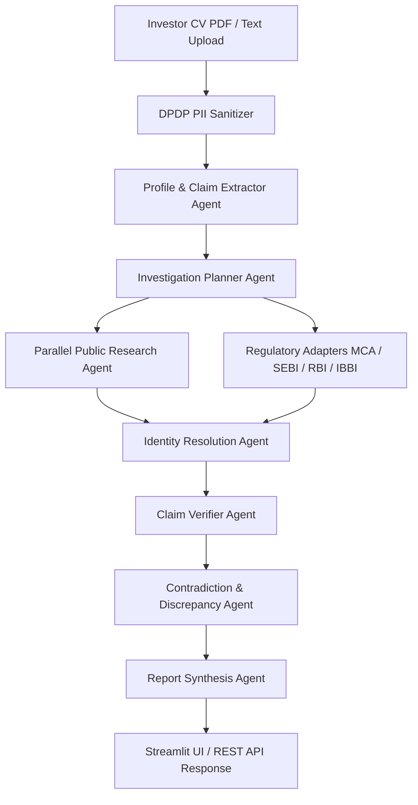

# AI Investor Due-Diligence Engine: Feature Implementation & System Architecture Guide

> **Target Audience:** Systems Architects, Backend Engineers, and Frontend Developers integrating autonomous evidence-based investor verification into external platforms (e.g., FundX, AI Investment Arena, or Dealflow CRM).

---

## 1. Core Philosophy & System Guarantees

The Investor Due-Diligence Engine operates on an **evidence-first, neutral verification model**. Unlike traditional background verification systems, it strictly avoids arbitrary scoring and defamatory language.

### Key Operational Guarantees

1. **No Trust Scores & No Character Judgments:**
   - The engine **never** outputs a numeric "trust score" (e.g., 85/100).
   - The engine **never** labels an individual as *fraudulent, fake, legitimate, scammer, or verified authentic*.
   - Statuses evaluate **public evidence strength**, not personal character.

2. **Standardized Neutral Status Framework:**
   - `STRONG EVIDENCE` / `VERIFIED`: Multiple independent, credible public sources or primary registry indexes corroborate the claim.
   - `PARTIALLY VERIFIED`: Corroborating evidence exists from a single secondary source, directory profile, or angel syndicate SPV footprint.
   - `REQUIRES VERIFICATION`: Educational or institutional credentials that require official registrar cross-referencing.
   - `INSUFFICIENT EVIDENCE` / `UNVERIFIED`: No independent public record was retrieved within the search budget. **Crucial Rule: Unverified does NOT mean false.**
   - `CONTRADICTED`: Public evidence directly refutes the claim or displays timeline/role discrepancies requiring human review.
   - `NOT APPLICABLE`: Claim is irrelevant to the entity type (e.g., SEBI AIF regulation check for an individual angel investor).

3. **Zero-Hallucination Source Guarantee:**
   - Every `source_url` and snippet cited in a report **must** originate directly from an HTTP payload returned by a search provider or official registry API. The LLM is strictly prohibited from inventing URLs.

4. **DPDP Compliance (Digital Personal Data Protection):**
   - Sensitive PII (Aadhaar, PAN, personal phone numbers, home addresses) is redacted via regex before sending text to external LLMs or search engines.
   - Uploaded PDF files are written to OS temporary files, processed in memory, and immediately deleted via an explicit `finally` block.

5. **Indian Market Nuances:**
   - **MCA Aggregators:** Does not attempt scraping Cloudflare-protected MCA V3 portals; uses B2B API if available, or falls back to public index matching (ZaubaCorp / Tofler).
   - **Angel Syndicate SPVs:** Recognizes that angel investments often appear under SPVs/Trustees (e.g., LetsVenture, AngelList) on MCA Form PAS-3 rather than individual personal names.
   - **Homonym Disambiguation:** Resolves common Indian names (e.g., *Aman Gupta*, *Rahul Sharma*) using an anchor tuple: `[Name + Current Org + Alma Mater + Prior Employers]`.

---

## 2. High-Level Architecture & Workflow Pipeline



### Pipeline Flow Summary

1. **Input:** PDF/Text document + Optional Metadata (Name, Organization, Designation, Investor Type, Website, LinkedIn hint).
2. **Sanitization:** Ephemeral text extraction + PII redaction (`[AADHAAR_REDACTED]`, `[PAN_REDACTED]`, etc.).
3. **Claim Extraction:** LLM (or fallback heuristic regex) breaks the CV into atomic verifiable claims.
4. **Search Planning:** Clusters 10–20 claims into a strict budget of 6–10 optimized web search queries.
5. **Research & Registry Lookup:** Parallel HTTP search execution + source tiering + MCA/SEBI registry checks.
6. **Identity Disambiguation:** Scores homonym risk and measures identity anchor overlap across retrieved hosts.
7. **Claim Verification:** Evaluates each claim against candidate evidence snippets (Gemini batch evaluation or deterministic heuristics).
8. **Contradiction Detection:** Checks timeline divergence (>=3 years mismatch) and junior vs executive role inconsistencies.
9. **Report Synthesis:** Compiles metrics, overall verdict, structured evaluations, risk flags, and sources.

---

## 3. Comprehensive Technical Component Breakdown

### Component 1: Document Parsing & DPDP Sanitizer (`tools/pdf_extractor.py`)

- **Extractors:** Tries `pdfplumber` first (retains layout); falls back to `pypdf.PdfReader`.
- **Regex Redaction Rules:**
  - **Aadhaar:** `\b\d{4}[\s-]?\d{4}[\s-]?\d{4}\b` -> `[AADHAAR_REDACTED]`
  - **PAN:** `\b[A-Z]{5}\d{4}[A-Z]\b` -> `[PAN_REDACTED]`
  - **Indian Phone:** `(?:\+91[\s-]?)?[6-9]\d{9}\b` -> `[PHONE_REDACTED]`
  - **Address Hint:** `(?im)^(?:address|residence|residing at|permanent address)\s*[:\-].+$` -> `[ADDRESS_REDACTED]`
- **File Lifecycle:** Uses `tempfile.NamedTemporaryFile` with explicit `Path(tmp_path).unlink(missing_ok=True)` in a `finally` block.

---

### Component 2: Profile & Claim Extraction (`agents/profile_extractor.py`)

- **Role:** Extracts an `InvestorProfile` object and a list of atomic `Claim` objects.
- **Claim Types Handled:**
  - `IDENTITY` (Subject identity claim)
  - `ORGANIZATION_EXISTENCE` (Existence of claimed fund/firm)
  - `CURRENT_ROLE` (Current designation at fund/firm)
  - `INVESTMENT` (Specific startup investment details: company, amount, stake, deal size, context)
  - `INVESTOR_ACTIVITY` (Public roles like Shark Tank India investor)
  - `EMPLOYMENT_HISTORY` (Prior roles and employers)
  - `EDUCATION` (Degrees, institutions)
  - `FUND_METRICS` (AUM, fund size)
  - `REGULATORY_STATUS` (SEBI AIF registration)
- **Extraction Mechanism:**
  - **LLM Mode (Primary):** Calls Gemini with a JSON schema prompt enforcing atomic statements.
  - **Heuristic Mode (Fallback):** Section header parser (`PROJECTS`, `INVESTMENTS`, `EDUCATION`, `EXPERIENCE`) and regex pattern matcher for amounts (e.g. `₹50 Lakhs`, `$1M`) and roles.
- **Identity Anchors:** Constructs an anchor list: `[full_name, organization, alma_mater, prior_employers[0..1]]`.

---

### Component 3: Investigation Planner (`agents/investigation_planner.py`)

- **Objective:** Prevents query explosion by clustering claims into 6–10 search queries instead of 1 search per claim.
- **Query Clustering Logic:**
  1. **Person & Org Anchor Query:** `'"Full Name" "Organization" AlmaMater investor India'`
  2. **Investments Cluster Query:** `'"Full Name" ("StartupA" OR "StartupB" OR "StartupC") (investor OR deal OR "Shark Tank" OR portfolio)'`
  3. **Employment Cluster Query:** `'"Full Name" "PriorEmployer" career'`
  4. **Education Cluster Query:** `'"Full Name" "UniversityName"'`
  5. **Registry Target Query:** `'site:zaubacorp.com OR site:tofler.in "Organization" CIN'`

---

### Component 4: Research Agent & Source Tiering (`agents/research_agent.py` & `tools/web_search.py`)

- **Multi-Provider Strategy:**
  - Calls `Tavily API` if `TAVILY_API_KEY` is present.
  - Falls back to `Serper API` or `DuckDuckGo` HTML parser.
  - Executes queries concurrently using `concurrent.futures.ThreadPoolExecutor(max_workers=6)`.

- **Source Classification Tiering System:**
  - **`TIER_1` (Authoritative):** `.gov`, `.edu`, `mca.gov.in`, `sebi.gov.in`, `rbi.org.in`, official university domains.
  - **`TIER_2` (Established Financial/Business Press):** Economic Times, LiveMint, Business Standard, TechCrunch, Inc42, YourStory, VCCircle, Financial Express, CNBC TV18.
  - **`TIER_3` (Secondary Registries & Corporate Directories):** ZaubaCorp, Tofler, Tracxn, Crunchbase, Pitchbook, Instafinancials, LinkedIn, AngelList/Wellfound.
  - **`TIER_4` (Public Web / Social Media):** Blogs, Medium, Reddit, Twitter/X, generic web pages.

- **Strict Investment Evidence Relevance Filter (`is_relevant_investment_evidence`):**
  - *Token Collision Prevention:* Filters out unrelated commercial products sharing a brand name (e.g., orthopedic wheelchair companies matching a startup named "Ottobock").
  - *Investor Co-occurrence:* Requires investor name (or anchor) + startup target name + deal keyword (`invest`, `funding`, `cheque`, `stake`, `shark tank`).
  - *Video/YouTube Filter:* Rejects YouTube links unless the title contains explicit deal/pitch context.

---

### Component 5: Regulatory Adapters (`agents/registry_agent.py` & `tools/`)

| Regulator Adapter | Behavior & Protocol |
| --- | --- |
| **MCA (Ministry of Corporate Affairs)** | Checks if `MCA_API_KEY` + `MCA_API_BASE_URL` are configured. If not, performs exact site search on ZaubaCorp/Tofler for CIN/DIN matching. Returns `STRONG EVIDENCE` if registered CIN found. |
| **SEBI** | Matches fund/firm name against a local snapshot of registered Category I/II/III AIFs & VCFs. Returns `NOT APPLICABLE` for individual angel investors. |
| **RBI** | Checks claimed NBFC/lending entities against registered NBFC snapshot. Defaults to `NOT APPLICABLE` unless lending activity is claimed. |
| **IBBI** | Evaluates insolvency practitioner or registered valuer claims. |

---

### Component 6: Homonym Disambiguation & Identity Resolution (`agents/identity_resolver.py`)

- **Homonym Collision Risk Algorithm:**
  - Scans full name against common Indian names dictionary (`aman`, `rahul`, `amit`, `sharma`, `patel`, `singh`, `kumar`, `gupta`, `reddy`, etc.).
  - Returns `HIGH` if name contains >=2 common name tokens or is a short 2-word common name.
- **Identity Confidence Scoring:**
  - Evaluates anchor presence in search hits: `Name (+1)`, `Organization (+2)`, `Alma Mater (+1)`, `Prior Employer (+1)`, `Distinct Hosts >= 3 (+1)`.
  - **Score >= 4:** `HIGH` confidence.
  - **Score 2–3:** `MEDIUM` confidence.
  - **High Homonym Risk without Org/Edu match:** `AMBIGUOUS` confidence.

---

### Component 7: Claim Verification Engine (`agents/claim_verifier.py`)

- **Evaluation Protocol:**
  - **Gemini Batch Evaluation:** Generates a structured JSON evaluation for claims with candidate evidence snippets.
  - **Deterministic Rule Engine (Fallback):** Evaluates evidence count, domain diversity, and source tiers.

- **Status Assignment Rules:**
  - **Multiple Independent Sources (>= 2 distinct domains) OR Primary/Tier 1 Source:** `STRONG EVIDENCE`.
  - **Single Secondary Source (Tier 2/3):** `PARTIALLY VERIFIED`.
  - **Angel Syndicate / SPV Signals (`LetsVenture`, `AngelList`, `SPV`):** `PARTIALLY VERIFIED (ANGEL/SYNDICATE FOOTPRINT)`.
  - **Educational Claims:** Single web mention -> `REQUIRES VERIFICATION` (requires university registrar query).
  - **No Search Hits:** `INSUFFICIENT EVIDENCE`.

---

### Component 8: Contradiction & Discrepancy Detection (`agents/contradiction_agent.py`)

1. **Timeline Mismatch Detector (`_timeline_mismatches`):**
   - Extracts contextual years (`19XX`, `20XX`) from retrieved evidence excerpts.
   - Compares found years with claimed tenure. If discrepancy >= 3 years (and role is not marked `present/ongoing`), flags a `TIMELINE_MISMATCH` contradiction (Severity: `MEDIUM`).
2. **Role Inconsistency Detector (`_role_inconsistencies`):**
   - If user claims a leadership role (`Partner`, `Managing Director`, `Founder`), but public excerpts contain junior tokens (`analyst`, `intern`, `campus ambassador`) at the same firm without leadership context, flags a `ROLE_INCONSISTENCY` contradiction (Severity: `HIGH`).

---

### Component 9: Report Synthesis Agent (`agents/report_agent.py`)

Synthesizes all outputs into the master `DueDiligenceReport` object:
- Calculates summary counts (`verified_count`, `partially_verified_count`, `unverified_count`, `contradicted_count`).
- Determines **Overall Evidence Strength**: `HIGH`, `MEDIUM`, `LOW`, or `INSUFFICIENT`.
- Generates **Overall Assessment Payload**:
  - `verdict` (e.g. `HIGH PUBLIC CORROBORATION — SELECTIVE PRIMARY AUDIT RECOMMENDED`)
  - `evidence_coverage_pct` (Percentage of claims with corroborating evidence)
  - `strongly_corroborated` list
  - `requires_verification` list
  - `risk_flags` list
- Attaches statutory `LEGAL_DISCLAIMER`.

---

## 4. UI & Verification Display Specification

To render the verification result effectively in your frontend (Web UI, React dashboard, or Streamlit app), implement the following 14 UI sections:

```
+-----------------------------------------------------------------------------------+
| 1. OVERALL ASSESSMENT BANNER                                                     |
| Verdict Title | Evidence Coverage % Badge                                         |
+-----------------------------------------------------------------------------------+
| 2. TWO-COLUMN HIGHLIGHTS                                                          |
| 🟢 Strongly Corroborated Findings          | 🟡 Items Requiring Verification       |
+-----------------------------------------------------------------------------------+
| 3. RISK & DISAMBIGUATION FLAGS (Yellow / Red Callout Boxes)                        |
+-----------------------------------------------------------------------------------+
| 4. INVESTOR PROFILE HEADER GRID (Name | Org | Designation | Timestamp)            |
+-----------------------------------------------------------------------------------+
| 5. CORROBORATION METRICS CARDS (Total | Strong | Partial | Insufficient | Contrad)  |
+-----------------------------------------------------------------------------------+
| 6. CONTRADICTIONS & DISCREPANCIES ALERT BOXES (If present)                       |
+-----------------------------------------------------------------------------------+
| 7. ENTITY RESOLUTION & HOMONYM RISK CARDS (Identity Confidence | Homonym Risk)   |
+-----------------------------------------------------------------------------------+
| 8. ORGANIZATION VERIFICATION CARD (MCA Status + Secondary Registry Link)          |
+-----------------------------------------------------------------------------------+
| 9. PERSON-TO-ORGANIZATION AFFILIATION CARD                                        |
+-----------------------------------------------------------------------------------+
| 10. INVESTMENT HISTORY (3-PART BREAKDOWN PER DEAL)                               |
| [Part 1: CV Claim] ---> [Part 2: Evidence & Tier Badges] ---> [Part 3: Assessment] |
+-----------------------------------------------------------------------------------+
| 11. EMPLOYMENT HISTORY LIST                                                      |
+-----------------------------------------------------------------------------------+
| 12. CLAIMS & EVIDENCE AUDIT TRAIL (Expandable Accordions with Clickable Links)    |
+-----------------------------------------------------------------------------------+
| 13. SOURCES CONSULTED BY CATEGORY (Regulatory | Financial Press | Public Web)     |
+-----------------------------------------------------------------------------------+
| 14. LEGAL DISCLAIMER & DOWNLOAD JSON REPORT BUTTON                                |
+-----------------------------------------------------------------------------------+
```

### Detailed Component Display Requirements

1. **Overall Assessment Banner:**
   - Dark gradient background (`#0f172a` to `#1e293b`).
   - Cyan verdict text (`#38bdf8`).
   - Pill badge displaying `{evidence_coverage_pct}% Evidence Coverage`.

2. **Status Badge Palette:**
   - `STRONG EVIDENCE` / `VERIFIED`: `#0f766e` (Deep Teal)
   - `PARTIALLY VERIFIED`: `#d97706` (Amber)
   - `REQUIRES VERIFICATION`: `#7c3aed` (Purple)
   - `INSUFFICIENT EVIDENCE`: `#64748b` (Slate Grey)
   - `CONTRADICTED`: `#b91c1c` (Red)
   - `NOT APPLICABLE`: `#94a3b8` (Light Grey)

3. **Source Tier Badges:**
   - `TIER_1` (Government/University): `#1d4ed8` (Royal Blue)
   - `TIER_2` (Financial Press): `#059669` (Emerald Green)
   - `TIER_3` (Secondary Directory): `#475569` (Slate)

4. **3-Part Investment Card Layout:**
   - **Column 1 (CV Claim Extracted):** Startup name, claimed cheque amount, equity stake %, valuation deal size, context.
   - **Column 2 (Independent Evidence):** List of retrieved web articles with Tier Badges, clickable URLs, and short snippet quotes.
   - **Column 3 (Final Assessment & Note):** Status badge + reasoning + PAS-3 equity audit reminder notice.

5. **Sanitized Text Helper (`clean_display_text`):**
   - Clean display text before rendering to strip raw markdown formatting artifacts, HTML tags, or unformatted newlines.

---

## 5. API Contracts & External Integration Guide

To integrate this verification engine into another backend system (e.g. FastAPI service in FundX), follow this specification.

### Data Schemas (JSON / Pydantic Equivalent)

#### 1. Input Request Schema (`POST /api/v1/diligence/investigate`)

```json
{
  "file_base64": "JVBERi0xLj... (encoded CV PDF/text)",
  "filename": "investor_cv.pdf",
  "metadata": {
    "investor_name": "Aman Gupta",
    "organization": "Imagine Marketing / boAt",
    "designation": "Co-Founder & CMO",
    "investor_type": "Angel Investor",
    "linkedin_url": "https://linkedin.com/in/...",
    "website": "https://boat-lifestyle.com"
  }
}
```

#### 2. Output Report Payload Schema (`DueDiligenceReport`)

```json
{
  "investor_name": "Aman Gupta",
  "claimed_organization": "Imagine Marketing / boAt",
  "claimed_designation": "Co-Founder & CMO",
  "investor_type": "ANGEL_INVESTOR",
  "investigation_timestamp": "2026-09-12T02:24:00Z",
  "total_claims": 12,
  "verified_count": 8,
  "partially_verified_count": 2,
  "unverified_count": 2,
  "contradicted_count": 0,
  "requires_review_count": 0,
  "overall_evidence_strength": "HIGH",
  "overall_assessment": {
    "verdict": "HIGH PUBLIC CORROBORATION — SELECTIVE PRIMARY AUDIT RECOMMENDED",
    "identity_confidence": "HIGH",
    "evidence_coverage_pct": 83.3,
    "strongly_corroborated": [
      "Organization existence: Imagine Marketing (ZaubaCorp / Tofler index match)",
      "Angel / Venture Investments: Corroborated in national business press (6 deals)"
    ],
    "requires_verification": [
      "Educational credentials require university registrar cross-reference.",
      "Private equity/angel investments require MCA Form PAS-3 filings for legal shareholding confirmation."
    ],
    "risk_flags": [
      "High Homonym Collision Risk: 'Aman Gupta' is a common name across Indian public registries."
    ]
  },
  "identity_resolution": {
    "identity_confidence": "HIGH",
    "homonym_collision_risk": "HIGH",
    "distinct_public_hosts": ["economictimes.indiatimes.com", "livemint.com", "yourstory.com", "zaubacorp.com"]
  },
  "regulatory_checks": [
    {
      "authority": "MCA",
      "relevance": "APPLICABLE",
      "status": "STRONG EVIDENCE",
      "details": "Active company CIN indexed on ZaubaCorp/Tofler.",
      "source_url": "https://www.zaubacorp.com/company/IMAGINE-MARKETING-LIMITED/U52399MH2013PLC249766"
    }
  ],
  "investment_evaluations": [
    {
      "company_name": "Skippi Ice Pops",
      "claimed_amount": "₹10 Lakhs",
      "final_status": "STRONG EVIDENCE",
      "evidence_summary": "Public media across 4 independent sources corroborates deal participation.",
      "sources": [
        {
          "name": "The Economic Times",
          "url": "https://economictimes.indiatimes.com/...",
          "tier": "TIER_2",
          "excerpt": "Shark Tank India investor Aman Gupta backed Skippi Ice Pops..."
        }
      ],
      "notes": "Public reporting corroborates deal participation; primary cap-table confirmation requires PAS-3."
    }
  ],
  "claims_with_evidence": [],
  "contradictions": [],
  "sources_consulted": [],
  "disclaimer": "This report summarizes publicly available evidence..."
}
```

---

## 6. Production Integration Recipe & Checklist

When implementing this engine in a production system (e.g. FundX backend):

1. **Environment Variables Required:**
   ```env
   GEMINI_API_KEY=your_gemini_key
   TAVILY_API_KEY=your_tavily_key
   # Optional Fallbacks / Extensions
   SERPER_API_KEY=your_serper_key
   MCA_API_KEY=your_enterprise_mca_key
   MCA_API_BASE_URL=https://api.enterprise-mca.in
   ```
2. **Asynchronous Processing:**
   - Web search and LLM claim evaluation take **15–45 seconds** per CV.
   - **Do NOT** execute synchronously inside a web HTTP thread.
   - Dispatch the workflow to a background task queue (e.g., Celery, Redis Queue, or FastAPI `BackgroundTasks`), and push real-time trace events over WebSocket to the frontend.
3. **Caching Layer:**
   - Wrap search requests with a Redis caching layer keyed by `hash(query)` (TTL: 7 days) to minimize search API costs.
4. **Database Persistence:**
   - Store the complete `DueDiligenceReport` JSON in PostgreSQL as a `JSONB` column (`due_diligence_reports` table) indexed by `investor_id` and `investigation_timestamp`.

---
